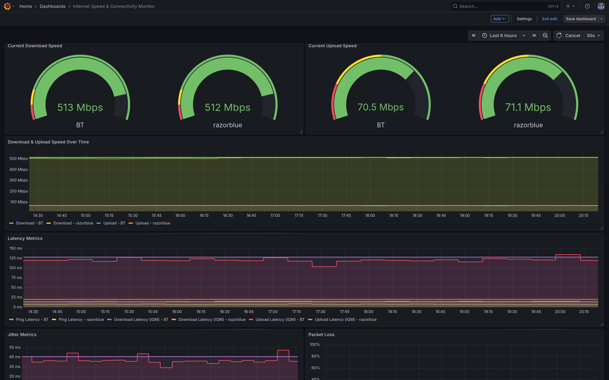
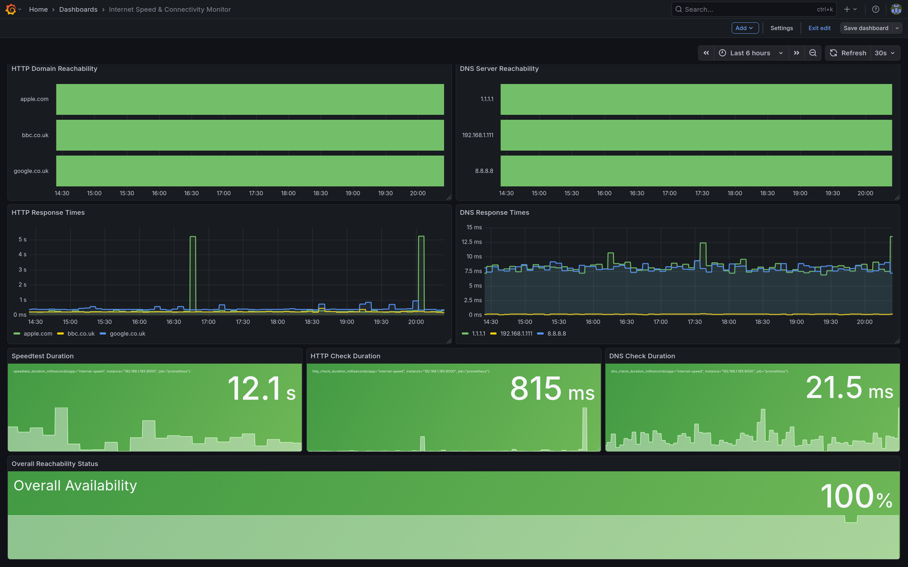

# Internet-Speed Monitoring Service

A Python service that monitors internet speed and connectivity,
exposing metrics via Prometheus on port 8000.
This service was mostly created so that my Dad would stop
asking me if I broke the WiFi.

Note: Prometheus is not included with this service but
the grafana dashboard is.

I am using this on an LXC on Proxmox with 256MiB RAM, but
usage hovers at around 65MiB.

## Screenshots





## Features

- Runs Ookla speedtest every 15 minutes
- Checks HTTP/DNS reachability every 5 minutes
- Exposes Prometheus metrics on port 8000
- Includes Grafana dashboard

## Quick Install

```bash
# Set optional env vars (or use defaults)
export LOGS_FILE_PATH="/var/log/internet-speed/internet-speed.log"
export HTTP_DOMAINS="bbc.co.uk,google.co.uk,apple.com"
export DNS_DOMAINS="1.1.1.1,8.8.8.8"

# Run installer
./install/install.sh
```

## Environment Variables

| Variable | Default | Description |
|----------|---------|-------------|
| `LOGS_FILE_PATH` | `/var/log/internet-speed/internet-speed.log` | Log file location |
| `HTTP_DOMAINS` | `bbc.co.uk,google.co.uk,apple.com` | Comma-separated domains for HTTP reachability checks |
| `DNS_DOMAINS` | `1.1.1.1,8.8.8.8` | Comma-separated IPs for DNS reachability checks |

## Manual Installation

### Setting environment variables
I also added my local DNS server to the list.
```bash
LOGS_FILE_PATH="/var/log/internet-speed/internet-speed.log"
HTTP_DOMAINS="bbc.co.uk,google.co.uk,apple.com"
DNS_DOMAINS="1.1.1.1,8.8.8.8"
LOGS_DIR=$(dirname "$LOGS_FILE_PATH")
```

### Installing speedtest client
See [here](https://www.speedtest.net/apps/cli) for the
speedtest CLI.
To use this, you will have to accept their license
and GDPR agreement.
This is handled in the python script.
```bash
sudo apt install curl
curl -s https://packagecloud.io/install/repositories/ookla/speedtest-cli/script.deb.sh | sudo bash
sudo apt install speedtest
```

### Cloning the repo
```bash
git clone <REPO_URL> /tmp/internet-speed
```

### Creating the user
```bash
sudo useradd --system --create-home --shell /bin/bash internet-speed --home-dir /opt/internet-speed
```

### Copying files
```bash
sudo cp -r /tmp/internet-speed/. /opt/internet-speed/
sudo chown -R internet-speed:internet-speed /opt/internet-speed
rm -rf /tmp/internet-speed
```

### Setting up Python
```bash
sudo -u internet-speed python3 -m venv /opt/internet-speed/venv
sudo -u internet-speed /opt/internet-speed/venv/bin/pip install -r /opt/internet-speed/requirements.txt
```

### Creating logging directory
```bash
sudo mkdir -p "$LOGS_DIR"
sudo chown internet-speed:internet-speed "$LOGS_DIR"
```

### Creating .env file
Copy the `.env.template` file with to `.env` and 
modify the env vars:
```
LOGS_FILE_PATH=
HTTP_DOMAINS=
DNS_DOMAINS=
```
Alternatively use the env vars set at the start to
create the `.env`.

### Installing systemd service
```bash
cp systemd/internet-speed.service.template /etc/systemd/system/internet-speed.service
systemctl daemon-reload
systemctl enable internet-speed
systemctl start internet-speed
```

## Prometheus Setup

Add to your 
[Prometheus](https://prometheus.io/docs/introduction/overview/)
config:
```yaml
scrape_configs:
  - job_name: 'internet-speed'
    static_configs:
      - targets: ['<SERVICE-IP|localhost>:8000']
```

## Grafana Dashboard

Import the dashboard from `grafana/dashboard.json`.
